# SpendGraph AI

Agentic personal-finance intelligence built around one rule:

> **AI interprets. Deterministic software controls money.**

## Status

SpendGraph AI is in **Phase 0: planning and foundation**. This phase establishes the
monorepo, API health contracts and web client foundation, PostgreSQL development
infrastructure, quality gates, and architecture documentation. The web application
executes a same-origin Apollo query for GraphQL `health` and `appInfo` through the
Vite development proxy and displays an online/offline foundation status. Dashboard
financial values remain clearly labelled synthetic data. This phase does **not** yet
implement a financial ledger, source connectors, AI extraction, reconciliation,
analytics, or an agent.

Documentation uses these labels:

- **Implemented** — present in the repository and expected to be executable.
- **Planned** — an accepted design direction, not working product functionality.

See the [implementation checklist](docs/implementation-checklist.md) for the
phase-by-phase source of truth. Do not interpret a diagram of planned components as
an implementation claim.

Latest local verification on 2026-07-23:

- `make check` passed: Ruff, Prettier, ESLint, strict mypy, TypeScript, 29 backend
  tests, 10 frontend tests, the Vite production build, and both dependency audits;
- `pip-audit` found no known vulnerabilities in the Python production lock and the
  npm production audit reported zero vulnerabilities;
- `make smoke` passed through Vite's browser-facing `/graphql` proxy to FastAPI; and
- standalone Compose configuration validation passed;
- API development/production and web development images built on Docker Desktop for
  Apple silicon; and
- PostgreSQL, API, and web services became healthy, `make migrate` reached the
  baseline on live PostgreSQL, and `make stop` preserved the named database volume.

The [implementation checklist](docs/implementation-checklist.md) records the full
ledger. Remote GitHub Actions and manual in-app-browser rendering remain explicitly
unverified.

## Problem

A person's financial state is spread across receipts, bank exports, delivery apps,
shared-expense tools, subscriptions, and informal notes such as “Lent Priya ₹800 for
a cab.” Conventional expense trackers record isolated transactions but often lose:

- who owes whom;
- whether two source events represent the same purchase;
- why a record exists and where it came from;
- future obligations and expected repayments; and
- the context required to explain a change in spending.

## Solution

SpendGraph AI will turn heterogeneous, user-authorized signals into a normalized,
provenance-backed financial ledger. Relational links between users, transactions,
people, debts, merchants, categories, recurring payments, and source evidence form a
practical **personal financial graph** in PostgreSQL.

AI is reserved for ambiguity: extracting structured facts, classifying uncertain
text, selecting read-only tools, and explaining verified results. Python, SQL, typed
schemas, database constraints, and explicit user confirmation remain responsible for
money, authorization, state transitions, and totals.

## AI design

The AI layer is deliberately **planned, not implemented in Phase 0**. It will sit
behind a provider-neutral structured-completion interface. Untrusted source content
may produce only a typed proposal, which must pass Pydantic validation, deterministic
business rules, authorization, and confidence/review policy before any canonical
write. Extraction models receive no database or administrative tools.

Deterministic services will calculate totals, reconciliations, and period
comparisons; a model may explain those verified results but cannot replace them.
Prompt/model versions, latency, token usage, cost, schema failures, and grounded
evaluation results will be recorded when the capability is introduced. See
[AI design](docs/ai-design.md) for the provider boundary, safety flow, and evaluation
plan.

## Architecture

The target is a modular monolith that can evolve without beginning as a distributed
system:

```mermaid
flowchart LR
    subgraph Sources["User-authorized sources · planned"]
        Notes[Manual notes]
        CSV[CSV imports]
        Mail[Receipt emails]
    end

    subgraph Ingestion["Ingestion and interpretation · planned"]
        Connectors[Connector adapters]
        Raw[(Immutable raw events)]
        Normalize[Normalized event contract]
        Extract[Structured AI extraction]
        Validate[Schema + business validation]
        Review[Confidence / review gate]
        Reconcile[Duplicate reconciliation]
        Categorize[Layered categorization]
    end

    subgraph Core["Deterministic core · planned"]
        Ledger[Ledger services]
        DB[(PostgreSQL)]
        Analytics[Financial analytics]
    end

    subgraph Delivery["Application boundary"]
        GQL[FastAPI + Strawberry GraphQL]
        Web[React + TypeScript]
        Agent[Read-only finance agent · later]
    end

    Notes --> Connectors
    CSV --> Connectors
    Mail --> Connectors
    Connectors --> Raw --> Normalize
    Normalize --> Extract --> Validate --> Review
    Review --> Reconcile --> Categorize --> Ledger
    Ledger <--> DB
    DB --> Analytics
    Ledger --> GQL
    Analytics --> GQL
    GQL --> Web
    Agent -->|typed service tools| Analytics
    Agent --> GQL
```



The Phase 0 executable slice is intentionally small:

```text
React dashboard
  → Apollo POST /graphql (same origin)
    → Vite development proxy
      → Strawberry health + appInfo
        → FastAPI application

PostgreSQL/Alembic → configured and migration-ready; no finance tables
```

Detailed boundaries and evolution triggers are documented in
[Architecture](docs/architecture.md).

## Features

| Capability | Status |
| --- | --- |
| FastAPI REST health and Strawberry GraphQL `health`/application-info contract | Implemented in Phase 0 |
| React/TypeScript dashboard shell with clearly labelled synthetic financial values | Implemented in Phase 0 |
| Same-origin Apollo `health`/`appInfo` query through the Vite proxy | Implemented in Phase 0 |
| Loading, online, offline, and retry states for API foundation health | Implemented in Phase 0 |
| PostgreSQL/Alembic development foundation | Implemented in Phase 0; no finance tables yet |
| Transactions, people, payables, receivables, recurring payments, summaries | Planned for Phase 1 |
| Normalized connectors, immutable raw events, evidence, retry-safe ingestion | Planned for Phase 2 |
| Natural-language extraction and confidence review | Planned for Phase 3 |
| Duplicate reconciliation and personalized categorization | Planned for Phases 4–5 |
| Deterministic analytics and grounded AI explanations | Planned for Phase 6 |
| Read-only finance agent over typed service tools | Planned for Phase 7 |

## Future improvements and delivery roadmap

| Phase | Capability | Status |
| --- | --- | --- |
| 0 | Monorepo, API health/client wiring, PostgreSQL, tooling, CI, documentation | **Current** |
| 1 | Deterministic ledger, debts, recurring payments, dashboard | Planned |
| 2 | Raw events, evidence, connector contract, idempotent ingestion | Planned |
| 3 | Natural-language notes, structured extraction, review queue | Planned |
| 4 | Reconciliation and duplicate-detection evaluation | Planned |
| 5 | Layered categorization and correction memory | Planned |
| 6 | Analytics, contribution analysis, recurrence, insights | Planned |
| 7 | Read-only finance agent over deterministic tools | Planned |
| 8 | Official, user-authorized external connector | Planned |
| 9 | Background processing and live status updates | Planned |
| 10 | Production observability and deployment hardening | Planned |

The MVP ends at a reliable deterministic ledger plus traceable ingestion and manual
note review. The agent is deliberately not an MVP prerequisite.

## Technology

| Area | Choice |
| --- | --- |
| Web | React, TypeScript, Vite, Apollo Client |
| API | Python 3.12+, FastAPI, Strawberry GraphQL, Pydantic v2 |
| Persistence | PostgreSQL, SQLAlchemy 2.x, Alembic |
| Styling and forms | Tailwind CSS; shadcn/ui, React Hook Form, and Zod when needed |
| Testing | pytest, Vitest, React Testing Library; Playwright when user flows exist |
| Tooling | Docker Compose, Make, uv locks, pip-audit, Ruff, mypy, npm audit, ESLint, Prettier |
| CI | SHA-pinned GitHub Actions, Dependabot, gitleaks |
| AI, later | Vendor-neutral provider interface; LangGraph only if orchestration warrants it |
| Semantic retrieval, later | pgvector only after a measured retrieval use case |

## Repository structure

```text
.
├── .github/                # CI contracts and dependency update policy
├── apps/
│   ├── api/                 # FastAPI/GraphQL, migrations, tests, Python locks
│   └── web/                 # React/TypeScript, frontend tests, npm lock
├── docs/
│   ├── adr/                 # Architecture decision records
│   ├── ai-design.md         # Planned AI boundary and reliability design
│   ├── architecture.md      # System context, modules, flows, scaling triggers
│   ├── data-model.md        # Conceptual Phase 1 relational model
│   ├── implementation-checklist.md
│   └── security.md          # Security and prompt-injection threat model
├── evals/                   # Planned labelled AI/reconciliation evaluation suites
├── packages/shared/         # Future generated or explicitly shared contracts
├── scripts/                 # Deterministic local/CI smoke contracts
├── .env.example
├── docker-compose.yml
├── Makefile
└── README.md
```

Folders for later phases may be placeholders during Phase 0.

## Local setup

### Prerequisites

- Docker with Docker Compose;
- Make;
- Node.js 24+ and npm for local tooling; and
- Python 3.12+.

Docker Compose is the standard development runtime:

```bash
make env
make dev
```

`make env` copies `.env.example` only when `.env` is absent. `make dev` builds and
starts the local PostgreSQL, API, and web services. By default, use:

- web: `http://localhost:5173`;
- API health: `http://localhost:8000/health`; and
- GraphQL: `http://localhost:8000/graphql`.

If a port is changed in `.env`, use that configured value instead.

### Command reference

| Action | Command |
| --- | --- |
| Create local environment file without overwriting one | `make env` |
| Install local backend/frontend dependencies | `make setup` |
| Refresh committed Python locks after dependency changes | `make lock` |
| Start the standard Compose development environment | `make dev` |
| Verify web → Vite proxy → GraphQL API and clean up | `make smoke` |
| Start only PostgreSQL | `make db-up` |
| Apply migrations from the local environment | `make migrate` |
| Start API locally | `make dev-api` |
| Start web locally | `make dev-web` |
| Run all tests | `make test` |
| Run all lint/format checks | `make lint` |
| Run Python and TypeScript type checks | `make typecheck` |
| Audit locked Python and runtime Node dependencies | `make audit` |
| Run lint, type checks, tests, web build, and dependency audits | `make check` |
| Stop Compose services, preserving named volumes | `make stop` |

### Environment variables

`.env.example` is the canonical variable inventory. Copy it to `.env` and keep the
local file uncommitted. The foundation requires settings in these categories:

- application environment, debug mode, host, port, and log level;
- PostgreSQL host, port, database, user, and password;
- exact allowed web origin(s);
- web host/port and the same-origin GraphQL path; and
- the loopback address used to publish Compose ports.

The PostgreSQL component variables are the normal configuration contract. The
backend derives a safely encoded `postgresql+psycopg` DSN from them. `DATABASE_URL`
is an optional full SQLAlchemy URL override for non-Compose local or deployed
environments; when supplied, it must use the same driver and include a host and
database. Compose deliberately supplies the component contract and changes the API's
database host to its internal `db` service.

Development defaults bind published services to `127.0.0.1`. The web client uses
`VITE_GRAPHQL_URL=/graphql`; Vite proxies that same-origin path to the API using
`VITE_DEV_API_TARGET` in development. Production/staging configuration rejects debug
mode, and production additionally rejects local database/CORS targets and the
development database password.

AI provider keys and OAuth credentials are not required in Phase 0. When introduced,
they must remain server-side, be redacted from logs, and never use a `VITE_` prefix.

For local quality checks, migrations, or running the processes outside containers,
install the Python and Node dependencies:

```bash
make setup
```

Then start PostgreSQL and the two development processes in separate terminals:

```bash
make db-up
make migrate
make dev-api
make dev-web
```

### Database migrations

Apply committed migrations to the locally configured database:

```bash
make migrate
```

When using the standard Docker-only path without a local Python environment, run the
same Alembic migration inside the API container:

```bash
docker compose exec api alembic upgrade head
```

Phase 0 configures Alembic; the first financial tables arrive in Phase 1. A future
schema change should be generated, reviewed as code, tested both forward and
backward where practical, and only then committed.

#### PostgreSQL named-volume lifecycle

`POSTGRES_USER`, `POSTGRES_PASSWORD`, and `POSTGRES_DB` initialize PostgreSQL only
when its named volume is empty. Editing those values later does **not** rewrite users,
passwords, or databases in an existing volume and may make the API's new credentials
disagree with the stored database.

`make stop` is the routine stop command and preserves the volume. Recovery
requires an explicit operator decision:

- preserve meaningful data, use the existing credentials, and deliberately migrate
  roles/passwords or restore a backup; or
- for disposable local data only, explicitly choose to remove and recreate the
  project volume after accepting that all local PostgreSQL data will be lost.

Volume deletion is never an automatic setup, migration, or troubleshooting step.

### Tests and quality checks

```bash
make test
make lint
make typecheck
```

Run the complete local gate with:

```bash
make check
```

Verify the browser-facing API path without Docker:

```bash
make smoke
```

The smoke target starts local Uvicorn and Vite processes, waits for both, POSTs the
foundation query through Vite's `/graphql` proxy, validates `health`/`appInfo`, and
cleans up both processes. CI contains the same web-to-API contract.

`make check` includes `make audit`. Python production and development requirements
are committed lock files; the frontend uses `package-lock.json` and `npm ci`.
Maintainers refresh Python locks only after a declared dependency change:

```bash
make lock
make check
```

CI is configured with immutable action SHAs, a PostgreSQL upgrade/downgrade/upgrade
migration cycle, Python and runtime Node audits, API/web container builds, Compose
validation, and a full-history gitleaks scan. Dependabot covers Python, npm, Docker,
and GitHub Actions dependencies. These are repository contracts; they are not
reported as remotely passed until an actual GitHub Actions run is observed.

Test and evaluation claims must come from actual runs. No AI accuracy or performance
number is published without a versioned dataset, command, and result.

### Evaluations

Evaluation harnesses are planned alongside the relevant capabilities and have no
Phase 0 run target. Once implemented, they will measure structured extraction field
accuracy, categorization quality, reconciliation precision/recall (with special
attention to false merges), and agent grounding/tool selection.

### Phase 0 demo

Run the direct Phase 0 vertical-slice acceptance:

```bash
make smoke
```

With the full development environment running, the equivalent API probes are:

```bash
curl http://localhost:8000/health
curl \
  -H 'content-type: application/json' \
  --data '{"query":"query { health appInfo { name version environment } }"}' \
  http://localhost:8000/graphql
```

Open `http://localhost:5173`. The sidebar performs the same GraphQL query through
the Vite proxy and shows loading, online metadata, or an offline state with retry.
The financial cards remain synthetic Phase 0 examples. Ledger-backed demo data and
the “Lent Priya ₹800” scenario are planned for later phases.

Stop local services with:

```bash
make stop
```

## Financial correctness

The deterministic core will enforce the following invariants:

- monetary values use Python `Decimal` and PostgreSQL `NUMERIC`, never binary floats;
- amounts always carry an ISO 4217 currency code;
- totals are scoped to one user and an explicit time range;
- receivables and payables are not silently mixed into spending;
- relative dates resolve against source time and the user's timezone;
- source retries are idempotent; and
- every AI-derived proposal retains evidence and a confidence/review decision.

Exact summary semantics live in [Data model](docs/data-model.md).

## Security and privacy

External notes, emails, CSV cells, merchant descriptions, and retrieved text are
**untrusted data**, never instructions. Extraction models will have no database or
administrative tools. Their structured output must pass schema validation,
business-rule validation, authorization, and a confidence gate before deterministic
services may persist a canonical record.

Other baseline requirements include tenant ownership checks, least-privilege OAuth
scopes, encrypted connector tokens, data minimization, secret redaction, bounded
GraphQL input, and read-only agent tools. See the full
[security threat model](docs/security.md).

Phase 0 already fails closed on unsafe production defaults and inexact/wildcard CORS
origins; disables GraphQL queries over GET; hides SQL parameters; emits path-only
request logs without query strings; returns correlated generic errors; binds Compose
ports to loopback; and locks/audits dependencies. These controls do not imply that
financial authorization exists before Phase 1.

## Deliberate trade-offs

- **Modular monolith before microservices:** clearer transactions and faster
  iteration; module boundaries preserve a future extraction path.
- **PostgreSQL before MongoDB or Neo4j:** financial integrity and relational queries
  matter more than schema flexibility or native graph traversal in the MVP.
- **GraphQL for the product API:** it fits dashboard-shaped reads and generated
  TypeScript types, but requires pagination, authorization, DataLoader, and query
  cost controls.
- **Database-backed/in-process work before a broker:** fewer failure modes now;
  introduce a durable queue when retries, concurrency, or latency isolation demand
  it.
- **Rules before LLMs:** lower cost, latency, and nondeterminism; use models only for
  semantic ambiguity.
- **pgvector is deferred:** add it only if correction or transaction retrieval
  measurably improves quality.

The rationale and consequences are recorded in [ADRs](docs/adr/).

## Documentation

- [Architecture](docs/architecture.md)
- [Conceptual data model](docs/data-model.md)
- [AI design](docs/ai-design.md)
- [Security and prompt-injection threat model](docs/security.md)
- [Implementation checklist](docs/implementation-checklist.md)
- [Architecture decisions](docs/adr/)

## Contributing

Work one phase at a time. A feature is not complete until its implementation,
relevant tests, lint/type checks, documentation, and acceptance path are all
verified. Do not add infrastructure, an AI framework, or a new datastore without a
measured requirement and an ADR.
