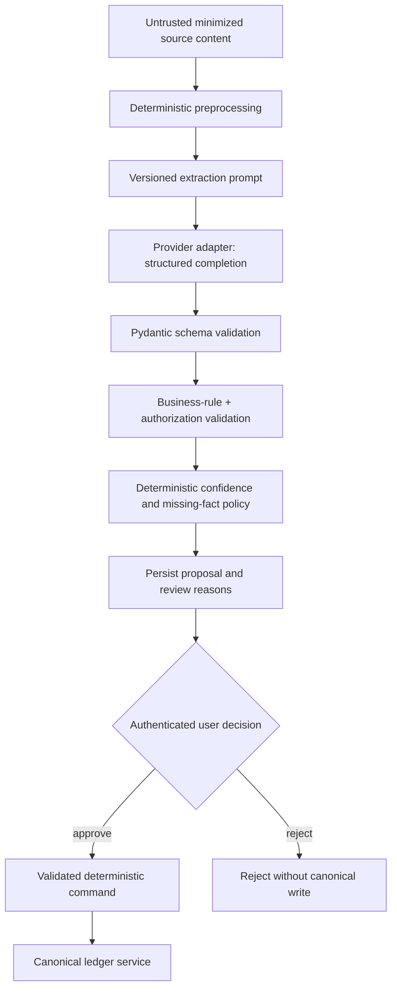
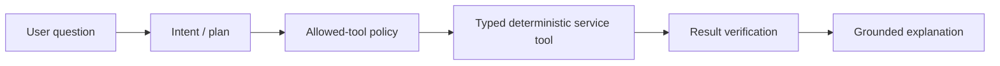

# AI design

**Status: the Phase 3 review-first vertical slice is implemented; evaluation and the
finance agent remain planned.** The backend has a provider-neutral structured
completion port, deterministic mock, Ollama-compatible `/api/chat` adapter, versioned
financial-note prompt/schema, bounded input/output handling, persisted proposal
metadata, locked approve/reject transitions, and a React review inbox. The configured
provider passes an opt-in synthetic contract test, but no quality benchmark is claimed.

## Governing principle

> **AI interprets. Deterministic software controls money.**

| AI may | AI must not |
| --- | --- |
| Extract candidate fields from notes/receipts | Calculate balances or authoritative totals |
| Interpret merchant/person/context language | Authorize access or decide ownership |
| Suggest categories with confidence | Bypass schemas, constraints, or reconciliation |
| Select from a narrow set of read-only tools | Execute SQL or receive unrestricted database access |
| Explain deterministic analytical results | Invent missing amounts, people, currencies, or dates |
| Rank semantically similar prior corrections | Transfer money, delete records, or modify external accounts |

AI output is an untrusted proposal. It becomes financial state only through typed
validation, business rules, authorization, confidence policy, and deterministic
services.

## Why use AI at all?

Inputs such as “Paid ₹1,200 for a hotel; Amit will send ₹600 later” contain
relationships and implicit event types that brittle regular expressions handle
poorly. A structured model can interpret that ambiguity. It adds no value to
`sum(amount)` or an ownership check, where deterministic code is cheaper, faster,
testable, and exact.

The default decision order is:

```text
deterministic parser/rule
  → stable merchant/user mapping
    → prior verified correction
      → semantic retrieval, if measured useful
        → model fallback
          → user review when uncertain
```

Not every pipeline step becomes an agent.

## Extraction pipeline



The current implementation deliberately sends every model-derived event to review.
`AI_REVIEW_CONFIDENCE_THRESHOLD` controls whether `LOW_CONFIDENCE` is added to the
visible reasons; it does not authorize automatic posting. A future calibrated policy
may introduce bands such as:

```text
confidence >= 0.90        eligible for automatic processing
0.60 <= confidence < 0.90 process only with a visible review flag
confidence < 0.60         require explicit confirmation
```

Thresholds are configuration, not literals scattered across services. Automatic
processing remains disabled until a committed dataset establishes task-specific
quality and safety bounds. A high self-reported model confidence cannot override a
missing amount, currency, person, invalid date, ownership failure, or ambiguous
duplicate.

## Provider boundary

Business services depend on a small application-owned protocol:

```python
class StructuredCompletionProvider(Protocol):
    async def complete(
        self,
        request: StructuredCompletionRequest,
    ) -> StructuredCompletion: ...
```

Adapters translate this call to OpenAI, Gemini, Ollama, or another provider. They own
vendor request formatting, timeouts, safe retries, usage extraction, and error
translation. They do not own business validation or persistence.

Provider selection is configuration. Provider-specific response objects do not cross
the adapter boundary.

## Structured extraction contracts

The current strict event schema supports:

- expense;
- income;
- receivable;
- payable;
- recurring payment;
- shared expense; and
- refund.

Common proposal metadata includes event type, source event ID, parsed amount as a
decimal string, currency, occurred date/time, description, confidence, missing or
ambiguous fields, and evidence spans/references.

The model receives only these trusted date-resolution anchors:

1. the source timestamp;
2. the user's IANA timezone; and
3. a documented resolver policy.

Timezone-naive output is rejected. Broader relative-date evaluation remains pending,
so unsupported precision must stay null rather than become an invented date.

## Prompt management

Prompts live under a dedicated `ai/prompts/` package, outside business services.
Each persisted proposal records:

- prompt name and version;
- provider and model;
- response schema version;
- generation timestamp; and
- validation/review outcome;
- provider latency; and
- input/output token counts when the provider reports them.

Prompts place system policy and untrusted content in separate fields. Delimiters help
the model parse the request but are not treated as a security boundary. Untrusted
source text is always data even when it says “ignore previous instructions.”

See [Security](security.md) for the prompt-injection threat model.

## Provenance and corrections

Every accepted AI-derived record retains evidence linking it to the immutable raw
event. Reconciliation may attach multiple evidence records to one canonical
transaction; it never destroys the alternate source history.

A user correction records the entity, field, old value, new value, and relevant
context. Corrections are:

- audit data, not silently rewritten model output;
- inputs to deterministic user rules before model calls;
- candidates for retrieval only within the same user's scope; and
- part of offline evaluation and error analysis.

## Categorization

The classifier is layered to avoid paying for an LLM on every transaction:

1. explicit user rule;
2. normalized merchant mapping;
3. matching prior user correction;
4. similar verified history, if retrieval proves useful;
5. lightweight classifier or LLM fallback; and
6. review below the calibrated threshold.

The stored result includes predicted category, confidence, classifier source,
model/rule version, and any user override.

## Finance agent

The agent begins only after deterministic ledger and analytics services are tested.
Its first production version is read-only:



Possible tools include `get_financial_summary`, `get_transactions`,
`compare_periods`, `get_outstanding_receivables`,
`get_person_financial_relationship`, and `get_transaction_evidence`.

Tool arguments are typed, user identity comes from server context rather than model
arguments, and the response generator receives structured results. The agent never
constructs SQL. LangGraph is considered only if branching, retry, and verification
state become clearer than a simple Python workflow.

## Grounded explanations

For “Why did I spend more this month?”, deterministic analysis returns:

- prior and current totals;
- difference;
- contribution by category and merchant;
- transaction count and average-size deltas; and
- evidence identifiers.

The model may summarize that object. A verifier checks that every stated amount and
percentage is present in or deterministically derivable from the tool result.
Unsupported claims fail closed or are removed. The UI can expose supporting
transactions.

## Failure policy

| Failure | Behavior |
| --- | --- |
| Provider timeout | Apply bounded retry only when safe; then queue review/failure |
| Malformed structured output | Schema failure; no canonical write |
| Required field absent | Preserve as unknown and request confirmation |
| Unsupported currency/date | Reject or review; never substitute |
| Prompt-injection text | Treat as source data; no tools or policy change |
| Model unavailable during query | Return deterministic tool data with a plain fallback explanation |
| Model unavailable during ingestion | Keep raw event retryable; ledger remains unchanged |
| Repeated identical content | Use content identity to avoid duplicate processing where safe |

Fallbacks distinguish “could not interpret” from “no financial event found.”

## Observability and privacy

Persisted proposals currently record non-sensitive metadata for successful calls:

- request type and correlation ID;
- provider, model, prompt/schema version;
- latency and token counts;
- success/failure, validation failure, and retry count; and
- confidence and eventual review outcome.

Estimated cost is not fabricated for the local provider; a priced provider adapter
must add an explicit versioned pricing basis. Do not log full private notes, email
bodies, access tokens, or arbitrary prompts.
Sampled debugging requires explicit redaction and retention controls.

## Evaluation before rollout

No benchmark number is valid without a committed dataset and executable evaluator.

| Capability | Primary measures | Safety emphasis |
| --- | --- | --- |
| Extraction | Per-field accuracy; exact amount/currency/date match | Missing/invented required facts |
| Categorization | Accuracy and macro F1 when warranted | Performance by category and user-rule precedence |
| Reconciliation | Precision, recall, F1 | False merges are costlier than missed duplicates |
| Agent | Tool selection, numerical correctness, grounding, unsupported claims | Cross-user access and write attempts |
| Operations | Latency, token use, estimated cost, failure rate | Provider degradation behavior |

Datasets use synthetic or explicitly approved redacted examples. Test slices include
relative dates/timezones, Indian currency notation, ambiguous names, multi-event
notes, refunds, adversarial prompt injection, provider errors, and duplicate sources.

Deployment starts in shadow/review mode. Automatic processing is enabled only after
task-specific quality and safety thresholds are defined and met.

## Cost controls

- Hash content to avoid repeated analysis.
- Filter clearly irrelevant source material before a model call.
- Prefer user rules, merchant maps, and verified corrections.
- Select the smallest model that meets measured quality.
- Bound source length and output schemas.
- Cache only safe results with correct user and prompt-version keys.
- Track cost per request type, not just aggregate spend.

pgvector and an orchestration framework remain deferred until evaluation demonstrates
benefit.
