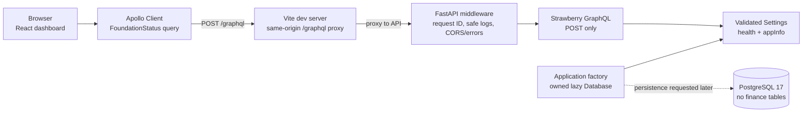
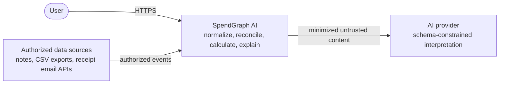
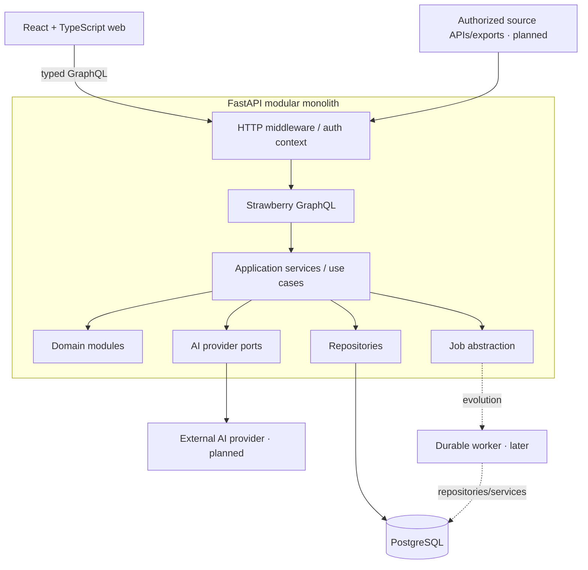
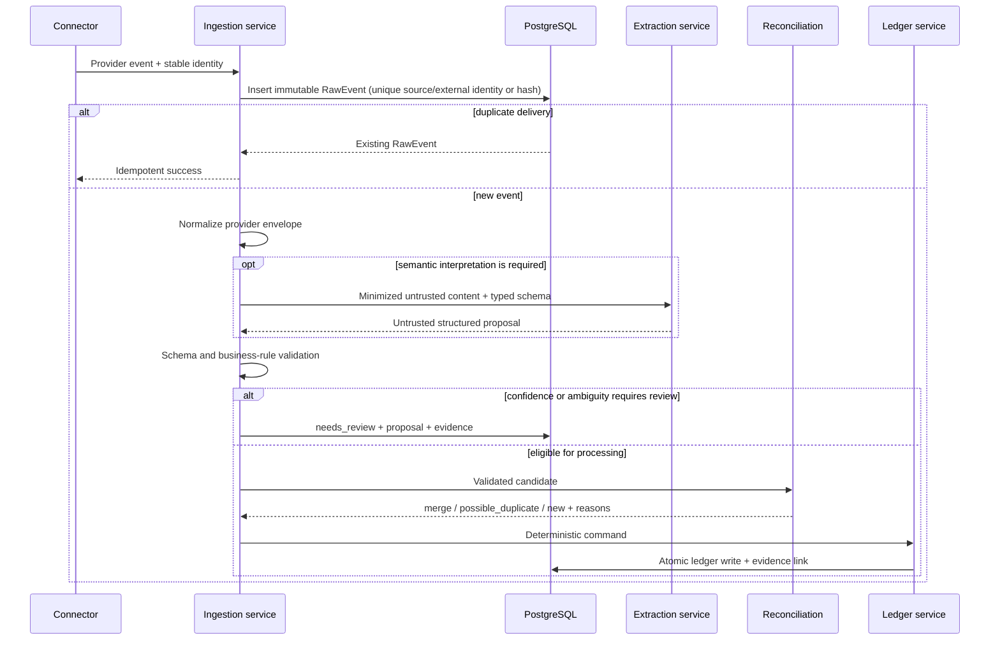

# Architecture

**Document status:** Phase 0 architecture baseline. The implemented application
surface is limited to API health contracts, a same-origin Apollo health/application
metadata query through the Vite proxy, and a dashboard whose financial values remain
synthetic. Unless marked **Implemented**, components below describe the planned
system.

## Goals

SpendGraph AI must:

1. build a consistent financial state from fragmented, partially structured input;
2. preserve evidence so every derived record can answer “why does this exist?”;
3. keep money, authorization, and state transitions deterministic;
4. support unreliable external sources and AI providers without duplicating records;
5. expose useful, typed product views without leaking business logic into GraphQL;
6. remain understandable enough to test and operate as a modular monolith; and
7. evolve toward asynchronous processing only when measured load requires it.

## Phase boundaries

| Capability | Delivery phase | Phase 0 status |
| --- | ---: | --- |
| React/Apollo → Vite proxy → GraphQL health vertical slice | 0 | Implemented and automated-test covered |
| PostgreSQL, migrations, local Compose, quality gates | 0 | Implemented and locally runtime-verified |
| Canonical ledger and deterministic summaries | 1 | Planned |
| Connector contract, raw events, evidence, idempotent ingestion | 2 | Planned |
| AI extraction and confidence review | 3 | Planned |
| Duplicate reconciliation | 4 | Planned |
| Personal categorization/correction memory | 5 | Planned |
| Analytics and deterministic insights | 6 | Planned |
| Read-only finance agent | 7 | Planned |
| Real OAuth connector | 8 | Planned |
| Durable queue/live processing UX | 9+ | Planned |

## Implemented Phase 0 runtime



The live web status query reads process health and non-sensitive application
metadata. Financial cards remain synthetic. REST and GraphQL health are liveness
contracts and intentionally do not force a database connection before Phase 1.

Local development uses `/graphql` as a browser-relative URL. The Vite proxy targets
the configured API, avoiding a browser cross-origin hop while preserving a direct
API CORS policy for callers that use the API origin.

`make smoke` is the executable contract for this path. It starts local Uvicorn and
Vite processes, waits for them, POSTs `health`/`appInfo` through the browser-facing
Vite `/graphql` endpoint, validates the response, and cleans up. It does not require
the financial database because the foundation query is intentionally process-only.

## Assumptions

- One user may own many source connections and financial records.
- PostgreSQL is the system of record; a model provider is never a source of truth.
- Dates are stored in UTC when they are instants. User-facing calendar decisions use
  the user's IANA timezone.
- Each amount has an explicit currency. The MVP reports by currency and does not
  invent exchange rates.
- External integrations use official APIs, OAuth, or user exports. Scraping private
  services is outside scope.
- The first deployment is a modular monolith with one API and one PostgreSQL
  database.

## System context



The AI provider is outside the trust boundary. Its output has the same trust level as
any other external input until validated.

## Target containers



GraphQL is a delivery adapter. Resolvers authenticate, validate API input, call one
or more application services, and map results. They do not calculate balances,
contain SQL, call model vendors directly, or own transaction boundaries.

In Phase 0, GraphQL queries are accepted only via POST; GET query execution is
disabled. GraphiQL is available only when validated debug configuration enables it.

## Runtime configuration and resource ownership

The normal PostgreSQL contract is one set of host, port, database, user, and password
components. The backend safely encodes those values into a
`postgresql+psycopg` SQLAlchemy URL. An explicit `DATABASE_URL` may override the
derived URL in non-Compose or deployment contexts, but only the expected driver with
a host and database is accepted.

Settings fail during startup when:

- a database URL uses the wrong driver or omits required location information;
- CORS contains a wildcard, credentials, path, query, fragment, or non-HTTP(S)
  origin;
- staging or production enables debug mode; or
- production uses local database/CORS targets or the development database password.

Compose overrides the API database host with its internal `db` service and publishes
database, API, and web ports to `127.0.0.1` by default. Web source and entrypoint
mounts are granular, so container-installed dependencies are not shadowed by a broad
host mount.

The application factory constructs a `Database` resource from its explicit settings
and places that resource on the application instance. The async engine is lazy,
request sessions are short lived, and lifespan shutdown disposes only the engine
owned by that application. This prevents global engine state from leaking between
tests or application instances. SQLAlchemy hides bound parameters in engine errors
and logs.

PostgreSQL image initialization variables apply only to an empty named volume. A
changed `.env` does not mutate credentials in an existing database. Preserving and
migrating existing data or deliberately discarding disposable local data is an
explicit operator decision; routine setup and `make stop` never delete the volume.

## Backend modules

| Module | Responsibility | Not responsible for |
| --- | --- | --- |
| `connectors` | Fetch provider data and normalize provider envelopes | Ledger writes or provider-specific logic leaking downstream |
| `ingestion` | Raw-event identity, processing state, retries | Interpreting arbitrary text |
| `ai` | Provider ports, prompts, schemas, model telemetry | Arithmetic, authorization, direct persistence |
| `ledger` | Canonical transactions and financial invariants | Source fetching |
| `reconciliation` | Candidate search, scoring, merge proposals | Destroying evidence |
| `categorization` | Layered category prediction and corrections | Financial totals |
| `insights` | Deterministic signals and grounded explanations | Unsupported claims |
| `security` | Authentication context, ownership policy, token handling | Domain-specific calculations |
| `graphql` | Typed delivery adapter | Business logic or SQL |
| `repositories` | Persistence queries and mappings | Product decisions |
| `workers` | Background execution and retry policy | Reimplementing services |
| `observability` | IDs, structured metadata, metrics/traces | Private-content logging |

These are conceptual boundaries. A folder should be introduced when its phase begins,
not created merely to mirror this table.

## Ingestion flow



Every transition is retry-safe. A retry may resume processing; it must not create a
second canonical transaction. Failed model calls leave the raw event recoverable.

## Deterministic write path

A canonical financial write follows this order:

1. authenticate and resolve the user;
2. validate the boundary schema;
3. authorize every referenced entity for that user;
4. execute domain invariants and calculations with `Decimal`;
5. persist within a database transaction;
6. record evidence/correction/audit metadata where applicable; and
7. publish only sanitized results.

AI output can become input to step 2, never a shortcut around steps 2–6.

## Query path

```text
GraphQL resolver
  → application service
    → repository query / deterministic analytics
      → typed result
        → GraphQL mapper
```

Queries require cursor pagination for unbounded collections. Batch relationship
loads with DataLoader where measurement or query inspection identifies N+1 access.
Summary services define amount, status, time-window, and currency semantics centrally
so different screens cannot calculate conflicting totals.

## Transaction and consistency model

- Ledger state changes and their evidence links commit atomically.
- Foreign keys and ownership-aware repository methods protect relationships.
- Unique constraints enforce natural idempotency identities.
- `NUMERIC` stores money; binary floating point is prohibited.
- Processing status changes use an explicit state machine.
- Reconciliation prefers a false negative over a destructive false merge. Ambiguous
  candidates enter review and retain all source evidence.
- Cross-currency totals are not produced without a separately sourced, timestamped
  conversion policy.

## Background work evolution

Phase 0 does not need a broker. Initial slow work can use an in-process job
abstraction only when losing an unstarted task is acceptable, or a PostgreSQL-backed
job/outbox when durability is required.

Introduce Redis plus a worker framework when at least one of these is observed:

- API latency is dominated by extraction or connector work;
- concurrent work needs bounded queues and backpressure;
- durable retries and dead-letter handling become operational requirements;
- work must continue independently of API process restarts; or
- horizontal API scaling causes duplicate in-process execution.

Kafka is justified much later only if durable event replay, high sustained
throughput, partition ordering, and several independent consumer groups create value
that a simpler queue cannot provide.

## Scalability path

| Pressure | First response | Later response |
| --- | --- | --- |
| Read-heavy dashboards | Proper composite indexes, query plans, pagination | Read replicas/caches for safe derived results |
| Slow AI calls | Async job boundary, timeout, retry budget | Independent extraction workers |
| Connector bursts | Cursoring, rate limits, backpressure | Per-connector queues/worker pools |
| Large transaction tables | Query/index measurement | Time partitioning only after evidence |
| Many API instances | Stateless auth context, DB pool limits | Autoscaling and connection pooling |
| Complex analytics | Precomputed deterministic aggregates | Dedicated analytical store only if measured |

Tenant isolation remains an application and database-query invariant at every scale.
“One million users” is not a reason by itself to split services.

## Failure handling

| Failure | Expected behavior |
| --- | --- |
| AI provider timeout/outage | Bounded retry, then `needs_review` or `failed`; ledger remains unchanged |
| Connector rate limit | Persist cursor/state, retry with backoff and jitter |
| Invalid model output | Record schema failure metadata without private payload; do not persist a ledger record |
| Duplicate delivery | Return idempotent success for the existing raw event |
| Ambiguous reconciliation | Preserve candidates and request review; do not auto-merge |
| Database failure | Roll back the entire unit of work |
| Unauthorized entity reference | Reject before query result or state mutation |

Domain errors are mapped to stable, non-sensitive GraphQL errors. Stack traces remain
in protected development/operational tooling, never client responses.

Phase 0 unexpected HTTP failures return a generic response with the request ID and
CORS headers intact. Logs record the stable error type and URL path, not the
exception text, SQL values, or query string.

## Observability

Phase 0 implements structured JSON request-completion events, validated request IDs,
path-only HTTP metadata, and correlated generic failures. The default Uvicorn access
log is disabled because it can include raw query strings. Production telemetry is
still planned. The target also includes:

- request and correlation IDs propagated into background jobs;
- structured event names and non-sensitive entity IDs;
- API/database/job latency and error metrics;
- AI provider/model, prompt version, request type, latency, tokens, estimated cost,
  validation failures, and retry count;
- connector lag and processing-state counts; and
- reconciliation decisions and review outcomes for evaluation.

Raw financial content, access tokens, full email bodies, and prompts containing
private data must not be logged.

## Quality and supply-chain gates

The repository commits separate Python production/development locks and the npm lock.
Normal setup installs from those locks; `make lock` is an explicit maintainer action
after dependency declarations change. `make audit` checks the Python production lock
with strict `pip-audit` behavior and checks runtime Node dependencies at high
severity; it is part of `make check`.

The GitHub Actions design contains:

- backend lint, type checks, tests, dependency audit, and a PostgreSQL
  upgrade/downgrade/upgrade migration cycle;
- frontend lint, format, type checks, tests, build, and runtime dependency audit;
- a locked-dependency web-to-API smoke job using the same `make smoke` contract as
  local development;
- standalone Compose validation and API development/production plus web image
  builds; and
- a full-history gitleaks scan.

Third-party actions are pinned to immutable commit SHAs. Dependabot covers Python,
npm, actions, and Docker sources. These jobs are configured but are not claimed as
passed until observed on a remote GitHub Actions run. Compose configuration was
validated locally; API development/production and web development images built, and
the Compose stack reached healthy database, API, and web states. The remote workflow
itself remains unverified.

## Deployment topology

The initial deployable shape is one static web application, one API service, one
worker process when needed, and managed PostgreSQL. Services share code-level domain
modules. This keeps ownership and transaction semantics clear while allowing the
worker or a high-load module to be extracted behind the same application interfaces
later.

## Related decisions

- [ADR-001: PostgreSQL over MongoDB](adr/ADR-001-postgresql-over-mongodb.md)
- [ADR-002: GraphQL API](adr/ADR-002-graphql-api.md)
- [ADR-003: LLM not responsible for arithmetic](adr/ADR-003-llm-not-responsible-for-arithmetic.md)
- [ADR-004: Connector normalization layer](adr/ADR-004-connector-normalization-layer.md)
- [ADR-005: PostgreSQL before an event broker](adr/ADR-005-postgresql-before-event-broker.md)
- [ADR-006: pgvector only when justified](adr/ADR-006-pgvector-only-when-justified.md)
