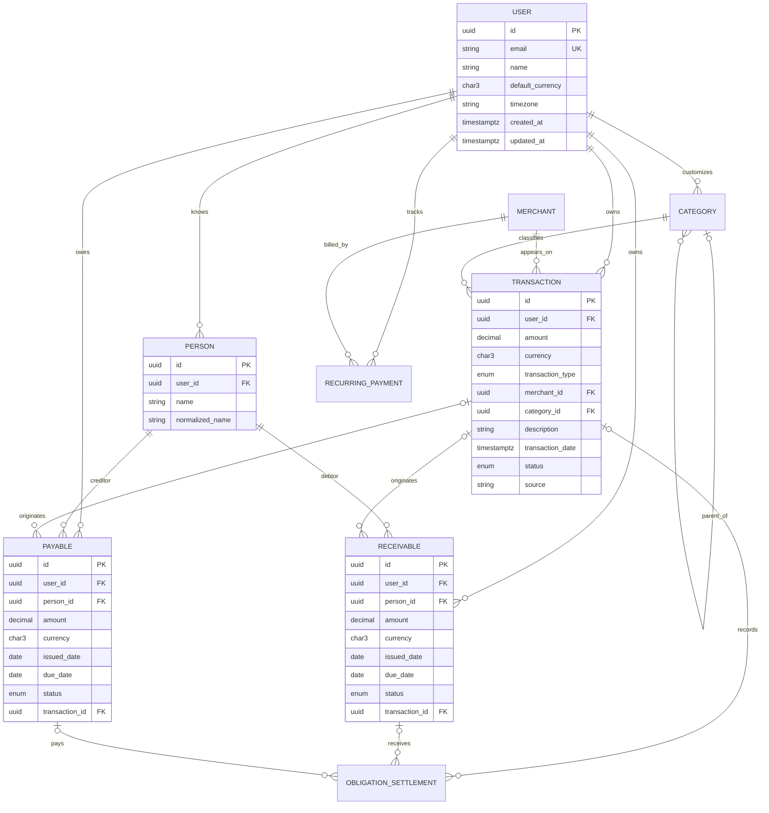

# Phase 1 data model

**Status: implemented.** Alembic revision `20260724_0002` and the SQLAlchemy models
are the executable source of truth. This document explains that deployed contract
and must change with future migrations.

## Scope

Phase 1 covers manually managed:

- users;
- merchants and categories;
- transactions;
- people;
- receivables and payables;
- obligation settlements; and
- recurring payments.

`SourceConnection`, immutable `RawEvent`, `Evidence`, and ingestion idempotency
arrive in Phase 2. `UserCorrection`, embeddings, and `AIInsight` arrive with their
later phases. No AI-derived field is needed for Phase 1.

## Data conventions

1. **Money:** Python `Decimal` and PostgreSQL `NUMERIC(19, 4)` store financial
   values. API amounts cross boundaries as decimal strings, never JSON floats.
2. **Currency:** every monetary row carries an uppercase ISO 4217 code. Totals group
   by currency; Phase 1 does not perform foreign-exchange conversion.
3. **Amount sign:** stored amounts are non-negative. `transaction_type` supplies the
   economic direction, avoiding mixed sign conventions.
4. **Time:** instants are timezone-aware and stored in UTC. A user's IANA timezone
   determines calendar periods such as “this month.”
5. **Identity:** externally exposed IDs are UUIDs. IDs alone never authorize access.
6. **Tenancy:** user-owned rows include `user_id`; every read and write is scoped by
   the authenticated user.
7. **Audit fields:** mutable entities have `created_at` and `updated_at`. Phase 1
   uses status transitions rather than deleting obligation history.
8. **Enums:** database checks and typed application enums use the values documented
   below and must evolve together.

## Relationship model



The diagram omits some nullable fields and audit columns for readability.

## Entities

### User

| Field | Notes |
| --- | --- |
| `id` | UUID primary key |
| `email` | Case-normalized unique login identifier |
| `name` | User-facing display name |
| `default_currency` | Default for entry, not permission to combine currencies |
| `timezone` | Valid IANA name, for example `Asia/Kolkata` |
| `created_at`, `updated_at` | UTC audit instants |

Phase 1 uses a fixed development identity abstraction selected by the server.
Production authentication is a separate concern from this domain profile.

### Merchant

| Field | Notes |
| --- | --- |
| `id` | UUID primary key |
| `normalized_name` | Stable normalized lookup value |
| `display_name` | Human-readable name |
| `domain` | Nullable verified/canonical domain |
| `merchant_category` | Nullable coarse merchant classification |
| `created_at` | UTC creation instant |

Merchants are canonical reference data rather than user-owned financial facts.
Repository queries must still prevent merchant lookup from becoming a path to other
users' transactions. Merchant merge/alias behavior is deferred until categorization.

### Category

| Field | Notes |
| --- | --- |
| `id` | UUID primary key |
| `user_id` | Null for system categories; set for user-defined categories |
| `name` | Display name |
| `parent_category_id` | Nullable self-reference |
| `created_at`, `updated_at` | Audit instants |

A user may assign system categories or their own categories, but never another
user's category. Parent and child must have compatible ownership. Database triggers
reject invisible parents and hierarchy cycles.

### Transaction

| Field | Notes |
| --- | --- |
| `id`, `user_id` | UUID identity and owner |
| `amount`, `currency` | Positive decimal amount and ISO currency |
| `transaction_type` | `expense`, `income`, `transfer`, `refund`, `shared_expense` |
| `merchant_id`, `category_id` | Nullable references |
| `description` | User-visible, length-bounded text |
| `transaction_date` | Economic occurrence instant |
| `source` | `manual` in Phase 1; normalized source identifiers arrive later |
| `confidence` | Nullable `[0, 1]`; unused for direct manual entry, populated by later derivation |
| `status` | Initially `pending`, `posted`, or `voided` |
| `created_at`, `updated_at` | Audit instants |

The transaction amount for `shared_expense` represents **the user's own expense
share**, not the full group bill. A related receivable/payable represents money to be
settled with another person. This prevents double-counting.

A `refund` is a positive amount with refund semantics. A future
`canonical_transaction_id` or explicit original-transaction link will be added with
reconciliation rather than guessed in Phase 1.

### Person

| Field | Notes |
| --- | --- |
| `id`, `user_id` | UUID identity and owner |
| `name` | User-entered display name |
| `normalized_name` | Case/whitespace-normalized matching value |
| `created_at`, `updated_at` | Audit instants |

Person records are private per user. Similar names must not be merged without a
deterministic rule or user confirmation.

### Receivable

A receivable means another person owes the user.

| Field | Notes |
| --- | --- |
| `id`, `user_id`, `person_id` | Identity, owner, and debtor |
| `amount`, `currency` | Original principal; immutable after settlement begins |
| `description` | Reason for the obligation |
| `issued_date`, `due_date` | Due date is nullable |
| `status` | `open`, `partially_paid`, `paid`, `overdue`, `cancelled` |
| `transaction_id` | Nullable originating transaction |
| `confidence` | Nullable `[0, 1]`; later extraction metadata, never authority |
| `created_at`, `updated_at` | Audit instants |

`overdue` is derived from open balance, due date, and the owner's current local date;
it is not persisted as a clock-driven update.

### Payable

A payable means the user owes another person. It has the same fields, nullable
confidence, and status semantics as a receivable, with `person_id` identifying the
creditor.

Creating an obligation does not itself create spending. If the underlying event is
an expense, it has an explicit transaction link.

### ObligationSettlement

This supporting table preserves partial-payment history instead of overwriting the
original obligation.

| Field | Notes |
| --- | --- |
| `id`, `user_id` | Identity and owner |
| `receivable_id`, `payable_id` | Exactly one must be set |
| `amount`, `currency` | Positive decimal; currency must match the obligation |
| `settled_at` | Economic settlement instant |
| `transaction_id` | Nullable transaction recording the cash movement |
| `note` | Nullable bounded context |
| `created_at` | Audit instant |

The database uses a check constraint requiring exactly one obligation reference.
Services lock or otherwise serialize competing settlement writes, reject settlement
beyond the outstanding balance, then derive status:

```text
settled = 0                         → open (or overdue)
0 < settled < obligation amount    → partially_paid
settled = obligation amount        → paid
```

Cancelled obligations reject new settlements.

### RecurringPayment

| Field | Notes |
| --- | --- |
| `id`, `user_id` | Identity and owner |
| `merchant_id` | Required canonical merchant |
| `amount`, `currency` | Expected positive amount |
| `recurrence_rule` | Validated weekly/monthly/quarterly/yearly rule initially |
| `next_expected_date` | User-calendar date |
| `confidence` | Nullable for manual records; constrained to `[0, 1]` later |
| `status` | `active`, `paused`, `ended`, or `needs_review` |
| `created_at`, `updated_at` | Audit instants |

Phase 1 manages these records manually. Deterministic detection begins in Phase 6
and will not infer recurrence from a single transaction.

## Financial summary semantics

Summary functions always accept `user_id`, a user-local period, and currency.

| Metric | Deterministic definition |
| --- | --- |
| Actual spending | Sum of `posted` `expense` and user-share `shared_expense` transactions in the period, less `posted` refunds in the period; excludes income and transfers |
| Income | Sum of `posted` income transactions in the period; refunds are reported separately |
| Open receivables | Sum of each non-cancelled receivable's original amount minus valid settlements |
| Open payables | Same calculation for payables |
| Upcoming recurring payments | Sum of active expected payments whose `next_expected_date` is inside the requested future window |
| Net financial exposure | Open receivables minus open payables, reported per currency |
| Category total | Actual-spending semantics grouped by category; uncategorized remains explicit |
| Merchant total | Actual-spending semantics grouped by merchant; unknown merchant remains explicit |

These are financial product definitions, not UI formulas. Receivables are assets,
payables are obligations, and neither is included in “actual spending” merely
because it exists. A query spanning currencies returns separate totals until an
explicit exchange-rate subsystem exists.

## Integrity rules

The Phase 1 implementation enforces:

- `amount > 0` for financial rows;
- valid three-letter currency codes;
- settlement currency equal to obligation currency;
- total settlements no greater than the obligation amount;
- exactly one receivable/payable reference per settlement;
- all linked user-owned entities belonging to the same user;
- a custom category and its parent having compatible ownership;
- recurrence and timezone values passing boundary validation;
- no hard deletion of settled obligations without an explicit retention policy; and
- atomic updates for a settlement and resulting obligation status.

Application checks improve messages; database constraints remain the final integrity
barrier.

## Implemented indexes

The migration creates the following query-driven indexes:

| Table | Index shape | Query served |
| --- | --- | --- |
| `transaction` | `(user_id, transaction_date DESC, id)` | Cursor-paginated timeline/date range |
| `transaction` | `(user_id, status, transaction_date)` | Summary calculations |
| `transaction` | `(user_id, category_id, transaction_date)` | Category analysis |
| `transaction` | `(user_id, merchant_id, transaction_date)` | Merchant analysis |
| `person` | unique `(user_id, normalized_name)` | User-local person lookup |
| `receivable` / `payable` | `(user_id, status, due_date)` | Open and overdue obligations |
| `obligation_settlement` | obligation foreign key | Outstanding balance calculation |
| `recurring_payment` | `(user_id, status, next_expected_date)` | Upcoming payments |

Every index has write/storage cost. Query plans and production-like data should
justify additional indexes.

## Deferred relationships

Later phases add, without weakening the Phase 1 ledger:

- `SourceConnection → RawEvent → Evidence → canonical entity` for provenance;
- processing-state and content-hash uniqueness for retry safety;
- reconciliation candidates and canonical-transaction relationships;
- `UserCorrection` for personalized classification;
- prompt/model/version metadata for AI-derived proposals; and
- `AIInsight` whose supporting data references deterministic analytical results.
